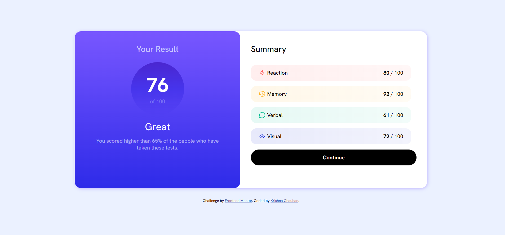

# Frontend Mentor - Results summary component solution

This is a solution to the [Results summary component challenge on Frontend Mentor](https://www.frontendmentor.io/challenges/results-summary-component-CE_K6s0maV).

## Table of contents

- [Overview](#overview)
  - [The challenge](#the-challenge)
  - [Screenshot](#screenshot)
  - [Links](#links)
- [My process](#my-process)
  - [Built with](#built-with)
  - [What I learned](#what-i-learned)
  - [Continued development](#continued-development)
- [Author](#author)

## Overview

### The challenge

Users should be able to:

- View the optimal layout for the interface depending on their device's screen size
- See hover and focus states for all interactive elements on the page

### Screenshot

### Links

- Solution URL: [Add solution URL here](https://your-solution-url.com)
- Live Site URL: [Add live site URL here](https://your-live-site-url.com)

## My process

### Built with

- Semantic HTML5 markup
- CSS custom properties
- Flexbox

### What I learned

-My knowledge of flexbox was enhanced.
-Learned about linear-gradient and -radial-gradient along with benefits of using opacityin real world websites.
-Knowledge of units like pixels and em were enhanced.

### Continued development

In future after learning JS I will enhance the website by using dynamic data .

## Author

- Github - [View My Github Profile](https://github.com/KrishnaKC15)
- Portfolio Website-[Visit My Portfolio Website](https://krishnakc15.github.io/Portfolio/)
- Frontend Mentor - [@KrishnaKC15](https://www.frontendmentor.io/profile/KrishnaKC15)
- Likedin- [Krishna Chauhan](https://www.linkedin.com/in/krishna-chauhan-1672b8345/)
- View my all Frontend projects live demo- [Frontend Projects](https://krishnakc15.github.io/frontend-mentor/)
