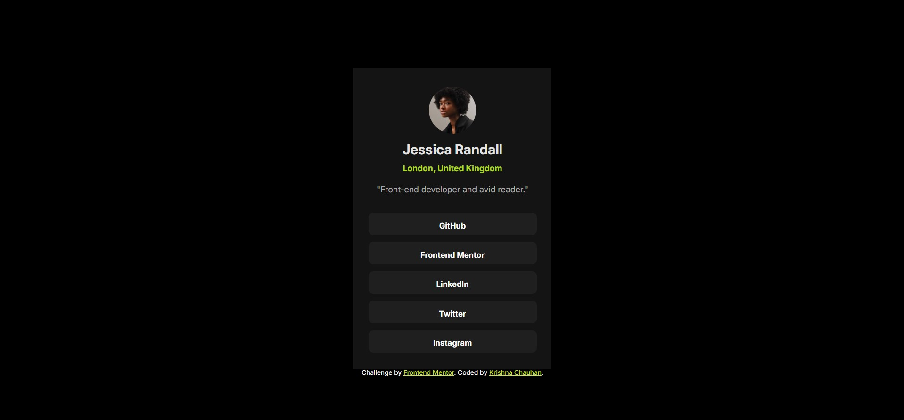

# Frontend Mentor - Social links profile solution

This is a solution to the [Social links profile challenge on Frontend Mentor](https://www.frontendmentor.io/challenges/social-links-profile-UG32l9m6dQ). Frontend Mentor challenges help you improve your coding skills by building realistic projects. 

## Table of contents

- [The challenge](#the-challenge)
- [Screenshot](#screenshot)
- [Links](#links)
- [Built with](#built-with)
- [Author](#author)

## Overview

### The challenge
- See hover and focus states for all interactive elements on the page

### Screenshot

### Links

- Solution URL: (https://github.com/KrishnaKC15/frontend-mentor/tree/main/social-links-profile-main)
- Live Site URL: [View live demo](https://krishnakc15.github.io/frontend-mentor/social-links-profile-main/index.html)

### Built with

- Semantic HTML5 markup
- CSS custom properties
- Flexbox

## Author

- Website - [Krishna Chauhan]()
- Frontend Mentor - [@KrishnaKC15](https://www.frontendmentor.io/profile/KrishnaKC15)
- Likedin- (https://www.linkedin.com/in/krishna-chauhan-1672b8345/)
