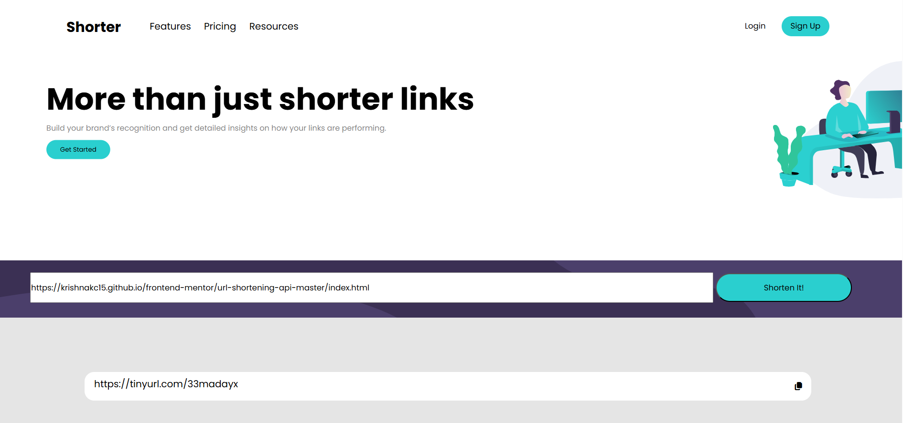

# Frontend Mentor - Shortly URL shortening API Challenge solution

This is a solution to the [Shortly URL shortening API Challenge challenge on Frontend Mentor](https://www.frontendmentor.io/challenges/url-shortening-api-landing-page-2ce3ob-G). Frontend Mentor challenges help you improve your coding skills by building realistic projects. 

## Table of contents

- [Overview](#overview)
  - [The challenge](#the-challenge)
  - [Screenshot](#screenshot)
  - [Links](#links)
- [My process](#my-process)
  - [Built with](#built-with)
  - [What I learned](#what-i-learned)
  - [Continued development](#continued-development)
- [Author](#author)

## Overview

### The challenge

Users should be able to:

- View the optimal layout for the site depending on their device's screen size
- Shorten any valid URL
- See a list of their shortened links, even after refreshing the browser
- Copy the shortened link to their clipboard in a single click
- Receive an error message when the `form` is submitted if:
  - The `input` field is empty

### Screenshot

### Links

- Solution URL: [Add solution URL here](https://github.com/KrishnaKC15/frontend-mentor/tree/main/url-shortening-api-master)
- Live Site URL: [Add live site URL here](https://krishnakc15.github.io/frontend-mentor/url-shortening-api-master/index.html)

## My process

### Built with

- Semantic HTML5 markup
- CSS custom properties
- Flexbox
- CSS Grid
- Mobile-first workflow
- TinyUrl API
- JS

### What I learned

- localStorage Api uses for keeping data even after refreshing website or closing and reopening of browser.
- learned a bit about CORS and importance of local web server in development.
- implemented my first api with the use of documentation and gemini ai.
- integrated complete knowledge of my JS till now.

### Continued development

I may improve the UI of the Website in near future.

## Author
- Github - [View My Github Profile](https://github.com/KrishnaKC15)
- Portfolio Website-[Visit My Portfolio Website](https://krishnakc15.github.io/Portfolio/)
- Frontend Mentor - [@KrishnaKC15](https://www.frontendmentor.io/profile/KrishnaKC15)
- Likedin- [Krishna Chauhan](https://www.linkedin.com/in/krishna-chauhan-1672b8345/)
- View my all Frontend projects live demo- [Frontend Projects](https://krishnakc15.github.io/frontend-mentor/)
